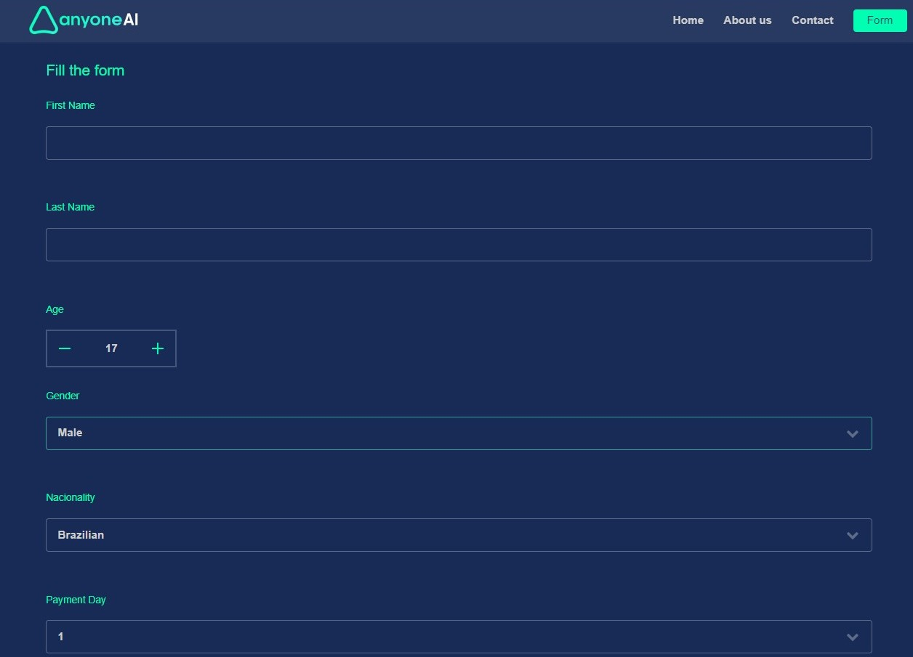
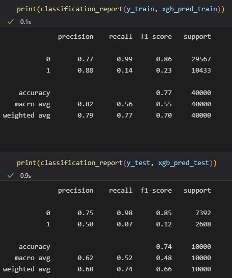

### Credit Risk Analysis by Mateo Bongiorno. 

This is an API service that is backed by a machine learning model that will accept a financial profile and will be able to predict a credit risk score for that profile, with the goal of predicting whether a person can apply for a loan or not, based on data provided through the form. The target value considered is "1", the person cannot pay off the loan.

<Here is what you need to see with respect to the steps followed...>

    1) Data Collection and Download Datasets can be found in download.py

    2) Exploratory Data Analysis and Visualization can be found in EDA.ipynb

    3) Pre-processing, Data Preparation, Model Training and Scores can be found in Model_Evaluation.ipynb

    4) Training scripts can be found in ./model, along with the requirements.

    5) Scripts and Web-page can be found in ./api, along with the requirements.

    6) Docker-Compose is used to run and load the Machine Learning Application. 

You can see the Project Structure at [Project Structure](proj_structure.md) .

Its composed by three microservices, that are configured to be excecuted with a docker-compose.yml file:

- api
- redis
- model

------------------------------------------------------------------------------------------------------

## Run the services.
To run the services enter the next command in your bash console:

```bash
$ docker-compose up --build -d
```

To stop the services:

```bash
$ docker-compose down
```

Next, go to the browser and search for "localhost".

Fill out the form displayed on the interface and submit it to get results on your input.

<div align="center"><br>
    
</div><br>

In the --form--, you must complete each field to make predictions of the prediction and probability associated. It will return "approved" if the prediction is "0" and the probability is less than "0.27", and "not approved" if the prediction is "1" and the probability is equal to or greater than "0.27".

-------------------------------------------------------------------------------------------------------

Conclusion:

Previous experiments were implemented with this model:

- `Logistic Regression`: baseline model with default parameters and also implementing a RandomizedSearchCV to search for the best hyperparameters.
- `LGBMClassifier`: with default parameters.
- `RandomForestClassifier`: with default parameters.
- `XGBoostClassifier`: with default parameters and also implementing a RandomizedSearchCV to search for the best hyperparameters.
- `Multilayer Perceptron (MLP)`: Deep Learning model.

The model selected for implementation in the API to make predictions was the `XGBoost Classifier` with default parameters, taking into account the values obtained in precision, recall, and the roc-AUC score of 0.638369229.
These are the metrics obtained for train and test:

<div align="center"><br>
    
</div><br>

Soruces and References:

- https://pakdd.org/archive/pakdd2010/PAKDDCompetition.html

- http://sede.neurotech.com.br/PAKDD2010/

- https://arxiv.org/abs/2112.13196

- https://arxiv.org/abs/2012.15330

- https://arxiv.org/ftp/arxiv/papers/1802/1802.05326.pdf

- https://towardsdatascience.com/credit-risk-analysis-with-machine-learning-736e87e95996

--------------------------------------------------------------------------------------------------------

By this, we have come to the end of this long project.

Thanks for trying to understand it, I hope you like it,
Mateo.
